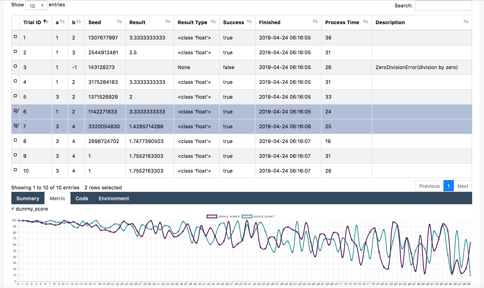

Dashboard
=========

`daskperiment` supports a web dashboard to check experiment histories.

Launch From Script
------------------

To launch the dashboard from script, use `Experiment.start_dashboard`.
It should be non-blocking when called from interactive
shell like Jupyter, and be blocking when executed as a file.

.. code-block:: python

   >>> ex = daskperiment.Experiment('your_experiment_id')
   >>> ex.start_dashboard()

Launch From Terminal
--------------------

To launch from the terminal, use `daskperimentboard` command providing your
experiment id.

.. code-block:: sh

   daskperimentboard your_experiment_id

Access To The Dashboard
-----------------------

After launching the dashboard, open
`http://localhost:5000/ <http://localhost:5000/>`_ .

